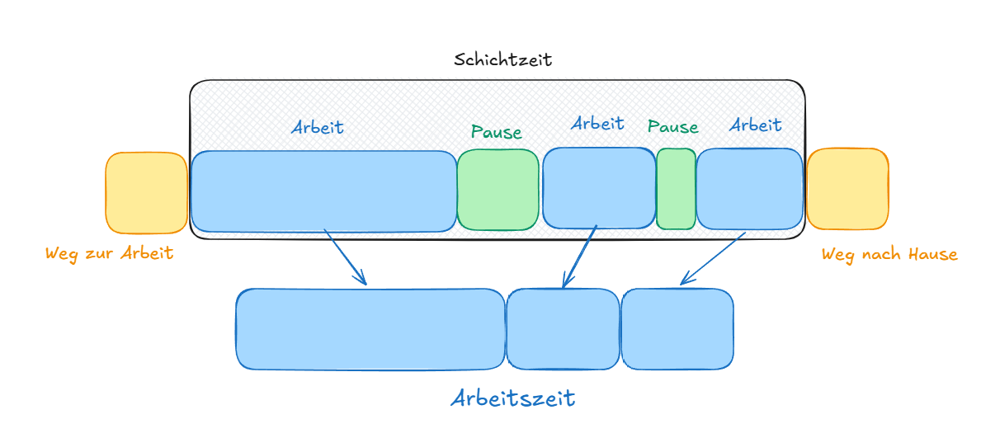

# Jugendarbeitsschutzgesetz (JArbSchG)

## §1

Der Arbeitgeber soll nicht sagen können: „Der ist ja gar kein richtiger Arbeitnehmer/Azubi, also gilt das JArbSchG nicht.“ Deshalb ist § 1 bewusst ziemlich weit formuliert

{{ task("tasks/JArbSchG_1_1.yaml") }}

{{ task("tasks/JArbSchG_1_2.yaml") }}

!!! tip "Merksatz §1"
    Unter 18 + Arbeit/Ausbildung = JArbSchG gilt!
    
    Ausnahme: gelegentliche Hilfe oder Eltern im Familienhaushalt.

## §2 Kind, Jugendlicher

{{ task("tasks/JArbSchG_2_1.yaml") }}

!!! tip "Merksatz §2"
    Kind ist höchsten 14 Jahre, Jugendlicher ist 15 bis 17 Jahre alt.

    Vollzeitschulpflicht sticht Jugendalter: Jugendlicher bleibt Jugendlicher, bekommt aber den strengeren Schutz für Kinder.

Merke dir vom eigenen Bundesland die Vollzeitschulpflicht für die Prüfung!

| Bundesland             |              Vollzeitschulpflicht |
| ---------------------- | --------------------------------: |
| Baden-Württemberg      |                      9 Schuljahre |
| Bayern                 |                      9 Schuljahre |
| Berlin                 |                     10 Schuljahre |
| Brandenburg            |                     10 Schuljahre |
| Bremen                 |                     10 Schuljahre |
| Hamburg                |                      9 Schuljahre |
| Hessen                 |                      9 Schuljahre |
| Mecklenburg-Vorpommern |                      9 Schuljahre |
| Niedersachsen          |                      9 Schuljahre |
| Nordrhein-Westfalen    | 10 Schuljahre, bei G8-Gymnasium 9 |
| Rheinland-Pfalz        |                      9 Schuljahre |
| Saarland               |                      9 Schuljahre |
| Sachsen                |                      9 Schuljahre |
| Sachsen-Anhalt         |                      9 Schuljahre |
| Schleswig-Holstein     |                      9 Schuljahre |
| Thüringen              |                     10 Schuljahre |

## §3 Arbeitgeber

## §4 Arbeitszeit

{{ task("tasks/JArbSchG_4.yaml") }}

!!! tip "Merksatz §4"
    * Arbeitstag: Ein Tag, an dem man wirklich arbeiten muss.
    * Werktag: Laut Gesetz (wie im Bundesurlaubsgesetz) sind das alle Tage außer Sonntag und Feiertag. Eine Woche hat sechs Werktage (Montag bis Samstag).
    * Samstag: Er ist ein Werktag, aber für die meisten kein Arbeitstag.
    * Feiertag und Sonntag: An diesen Tagen ist die Arbeit meistens verboten, es gibt Ausnahmen für bestimmte Berufe wie Pflege oder Gastronomie

Was sind kodifizierte Zusatzqualifikationen?

Kodifizierte Zusatzqualifikationen sind zusätzliche Qualifikationen, die ein Azubi während seiner Ausbildung freiwillig erwerben kann und die offiziell in der jeweiligen Ausbildungsordnung geregelt sind.

Kodifiziert = steht offiziell in der Ausbildungsordnung.

Nicht kodifiziert = zusätzlich angeboten, aber nicht Bestandteil der Ausbildungsordnung.

was ist eine standardberufsbildposition = berufsunabhängige Mindestkompetenzen, die in die betriebliche Ausbildung integriert werden.