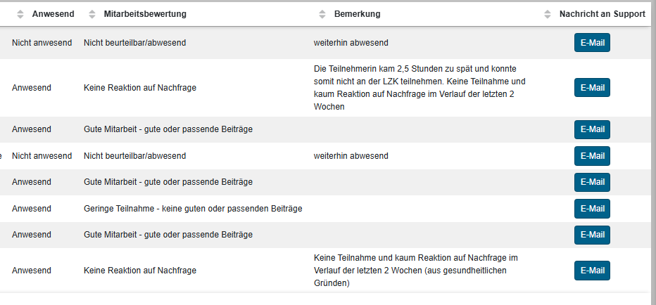

# Login

In diesem Abschnitt wirst du dich in alle System des Kunden einloggen. Hierzu hast du eine E-Mail vom bfz mit Zugangsdaten erhalten.

## LMS

{{ youtube_video("https://www.youtube.com/embed/8bQoZmuIQG8?si=tYNPtUunIn_L7moo", "Einloggen ins LMS", expanded=True) }}

{{ link("Lernmanagmentsystem (LMS) des bfz", "https://lms.bbw.de/") }}

## Microsoft Teams

{{ youtube_video("https://www.youtube.com/embed/C7NyuanklKA?si=bP7ZdJch90PuYTA5", "Einloggen bei Teams", expanded=True) }}

{{ link("Login Teams im Browser", "https://teams.microsoft.com/v2/") }}

{{ link("Microsoft Teams herunterladen", "https://www.microsoft.com/de-de/microsoft-teams/download-app")}}

{{ youtube_video("https://www.youtube.com/embed/tsjxVUIXT_s?si=qagxhkNx219Cdasp", "Einstellungen für Teams", expanded=True) }}

Checkliste:

* [ ] weitere Apps auffindbar
* [ ] Teams Kacheln auf Liste umstellen
* [ ] Alle Kanäle werden angezeigt
* [ ] Profilbild einfügen
* [ ] Ausbilder und Qualidymitarbeiter als Favouriten speichern. 

| Team | Name | Mail im Teams-Chat des bfz | Anmerkungen |
|-|-|-|-|
| bfz | Joao Matobo | {{ mail("joao.matobo@bfz.de") }} | Rufname "Flo" |
| bfz | Carola Dyba | {{ mail("carola.dyba@bfz.de") }} | |
| bfz | Burghard Gabsch | {{ mail("burghard.gabsch@bfz.de") }} | |
| bfz | Rudolf Schmidkonz | {{ mail("Rudolf.schmidkonz@bfz.de") }} | |
| bfz | Technischer Support des bfz | {{ mail("louis@support.bbw.de") }} |  |
| Qualidy | Daniel Schmidt | {{ mail("vc-vc-trai307@Schulung-bbw.de") }}  | Per Mail nur über {{ mail("daniel.schmidt@qualidy.de") }} erreichbar |
| Qualidy | Viktor Reichert | {{ mail("vc-vc-trai253@Schulung-bbw.de") }} | Per Mail nur über {{ mail("viktor.reichert@qualidy.de") }} erreichbar |
| Qualidy | Daniel Nergiz | | Per Mail nur über {{ mail("daniel.nergiz@qualidy.de") }} erreichbar |

Wenn ihr eine Mail an die Ausbilder des bfz habt und sichergehen wollt, dass diese möglichst schnell gelesen wird, sendet sie bitte an alle Ausbilder des bfz.

!!! danger "Die vc-Mail nur beim bfz verwenden"
    Bitte verwendet die vom bfz bereitgestellte Mail nicht für private Zwecke, sondern ausschließlich für den Unterricht beim bfz. Falls du zu einem Teamsmeeting mit einem anderen Kunden eingeladen bist, achte bitte auch darauf nicht mit dem bfz-Account teilzunehmen!

## Unterrichtsnachweisportal

{{ youtube_video("https://www.youtube.com/embed/sP3qKZygqOM?si=CPX2IbqgOew2Isj3", "Anleitungsvideo Unterrichtsnachweis Trainer", expanded=True) }}

Abschließend musst du dich nun noch auf dem 
{{ link("Portal für Unterrichtsnachweise", "https://unterrichtsnachweis-service.bfz.de/trainerportal/") }}
anmelden.

Falls das Initiale Passwort `1Changeme!` nicht funktioniert, kannst du unter der Anmeldemaske ein "Neues Kennwort anfordern" klicken.

Die Mail, die du hier angibst, kann entweder die sein, die du Qualidy gegeben hast und wir an das bfz weitergeleitet haben
oder die "vc-vc-trai"-Email, die du von bfz erhalten hast. Im zweiten Fall kannst du auf diese über den Browser zugreifen 
({{ link("outlook.com", "https://outlook.com") }}).

!!! danger "Immer speichern!"
    Drückt bei jeder Änderung im Protokoll direkt auf "Speichern". Die Änderungen werden nämlich nicht automatisch gespeichert und es
    gab schon einige Trainer, die erstaunt geguckt haben, dass ihr Browser sich nach einigen Stunden "plötzlich" aktualisierte und
    alle Ihre Eintragungen verschwunden waren.

!!! tip "Unterrichtsnachweis ist wahnsinnig wertvoll und stark"
    Bitte dokumentiert ausführlich, wenn Teilnehmer gute oder schlechte Unterrichtsleistungen zeigen, insbesondere Abwesenheiten. Wenn ihr diese nicht notiert, gibt es keinen Nachweis über das Fehlverhalten der Teilnehmer. In dem Beispiel unten siehst du einen gut ausgefüllten Nachweis. Dieser war sehr hilfreich einige Teilnehmer zu besserer Mitarbeit zu bewegen. (Helft den Ausbildern Hebel in der Hand zu haben.)

    

Super, jetzt hast du dich zu allen Portalen angemeldet, die du für den Unterricht brauchst!🎉🥂🥳
