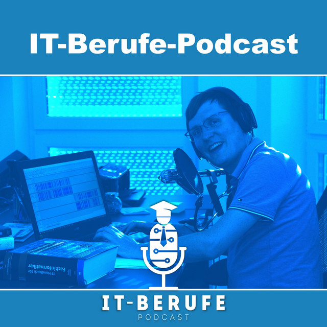

# Unterrichtsplanung

## Inhaltliche Planung

{{ youtube_video("https://www.youtube.com/embed/0Xkxuuquj2g?si=wHhIw84eXQBmvQMr", "Was muss unterrichtet werden?", expanded=True) }}

{{ link("bbib: Fachinformatiker Anwendungsentwicklung", "https://www.bibb.de/dienst/berufesuche/de/index_berufesuche.php/profile/apprenticeship/80000") }}

{{ link("bbib: Fachinformatiker Systemintegration", "https://www.bibb.de/dienst/berufesuche/de/index_berufesuche.php/profile/apprenticeship/olkiu98") }}

Die Inhalte um LMS nutze ich gerne als Vorlage für meine Unterrichtsnachweise. So erleichtert man den Prüfern im Audit zu erkennen, ob die
benötigten Inhalte tatsächlich unterrichtet wurden.

!!! info "Bücher"

    Den Teilnehmern wurden folgende Bücher für die Ausbildung zur Verfügung gestellt:

    **Fachinformatiker Anwendungsentwicklung (FIAE)**							

    * {{ link("IT-Berufe Grundstufe IT Lernfelder 1 - 5, 2. Auflage, 2025", "https://www.westermann.de/artikel/978-3-14-220001-9/IT-Berufe-Grundstufe-Lernfelder-1-5") }}, 978-3-14-220001-9
    * {{ link("Lernsituationen Grundstufe Lernfelder 1-5 - Arbeitsbuch, 2. Auflage, 2025","https://www.westermann.de/artikel/978-3-14-220009-5/IT-Berufe-Arbeitsbuch-Lernsituationen-Grundstufe-Lernfelder-1-5") }}, 978-3-14-220009-5
    * {{ link("IT-Berufe Fachstufe Technische IT-Berufe Lernfelder 6-9, 2. Auflage, 2026 (Erscheint im April 2026)","https://www.westermann.de/artikel/978-3-14-220037-8/IT-Berufe-Fachstufe-Technische-IT-Berufe-Lernfelder-6-9") }}, 978-3-14-220037-8
    * {{ link("IT-Berufe Fachstufe Technische IT-Berufe 6 - 9 -Arbeitsbuch, 2. Auflage, 2026 (Erscheint im April 2026)","https://www.westermann.de/artikel/978-3-14-220045-3/IT-Berufe-Fachstufe-Technische-IT-Berufe-Lernfelder-6-9") }}, 978-3-14-220045-3
    * {{ link("Einstieg in C# mit Visual Studio 2022, 8. Auflage, 2026","https://www.rheinwerk-verlag.de/einstieg-in-c-sharp-mit-visual-studio/") }}, 978-3-367-10849-7
    * {{ link("IT-Berufe Fachstufe II Fachinformatiker/-in Anwendungsentwicklung Lernfelder 10-12, 2. Auflage, 2026 (Erscheint im April 2026)","https://www.westermann.de/artikel/978-3-14-220073-6/IT-Berufe-Fachstufe-II-Fachinformatikerin-Anwendungsentwicklung-Fachinformatikerin-Daten-und-Prozessanalyse-Lernfelder-10-12-auch-einsetzbar-in-anwendungsbezogenen-IT-Studiengaengen") }}, 978-3-14-220073-6
    * {{ link("IT-Berufe Fachstufe II Fachinformatiker/-in Anwendungsentwicklung,  Lernfelder 10-12 - Arbeitsbuch, 2. Auflage, 2026 (Erscheint im April 2026)","https://www.westermann.de/artikel/978-3-14-220081-1/IT-Berufe-Fachstufe-II-Fachinformatikerin-Anwendungsentwicklung-Fachinformatikerin-Daten-und-Prozessanalyse-Lernfelder-10-12-auch-einsetzbar-in-anwendungsbezogenen-IT-Studiengaengen") }}, 978-3-14-220081-1

    **Fachinformatiker Systemintegration (FISI)**
                                                    
    * {{ link("IT-Berufe Grundstufe IT Lernfelder 1 - 5, 2. Auflage, 2025","https://www.westermann.de/artikel/978-3-14-220001-9/IT-Berufe-Grundstufe-Lernfelder-1-5") }}, 978-3-14-220001-9										
    * {{ link("Lernsituationen Grundstufe Lernfelder 1-5 - Arbeitsbuch, 2. Auflage, 2025","https://www.westermann.de/artikel/978-3-14-220009-5/IT-Berufe-Arbeitsbuch-Lernsituationen-Grundstufe-Lernfelder-1-5") }}, 978-3-14-220009-5										
    * {{ link("IT-Berufe Fachstufe Technische IT-Berufe Lernfelder 6-9, 2. Auflage, 2026 (Erscheint im April 2026)","https://www.westermann.de/artikel/978-3-14-220037-8/IT-Berufe-Fachstufe-Technische-IT-Berufe-Lernfelder-6-9") }}, 978-3-14-220037-8										
    * {{ link("IT-Berufe Fachstufe Technische IT-Berufe 6 - 9 -Arbeitsbuch, 2. Auflage, 2026 (Erscheint im April 2026)","https://www.westermann.de/artikel/978-3-14-220045-3/IT-Berufe-Fachstufe-Technische-IT-Berufe-Lernfelder-6-9") }}, 978-3-14-220045-3										
    * {{ link("Einstieg in C# mit Visual Studio 2022, 8. Auflage, 2026","https://www.rheinwerk-verlag.de/einstieg-in-c-sharp-mit-visual-studio/") }}, 978-3-367-10849-7										
    * {{ link("IT-Berufe Fachstufe II Fachinformatiker/-in Systemintegration, Fachinformatiker/-in Digitale Vernetzung Lernfelder 10-12, 1. Auflage, 2023","https://www.westermann.de/artikel/978-3-14-220108-5/IT-Berufe-Fachstufe-II-Fachinformatikerin-Systemintegration-Fachinformatikerin-Digitale-Vernetzung-Lernfelder-10-12") }}, 978-3-14-220108-5										
    * {{ link("IT-Berufe Lernsituationen Fachstufe II Fachinformatiker/-in Systemintegration, Fachinformatiker/-in Digitale Vernetzung Lernfelder 10-12, 1. Auflage, 2024","https://www.westermann.de/artikel/978-3-14-220116-0/IT-Berufe-Lernsituationen-Fachstufe-II-Fachinformatikerin-Systemintegration-Fachinformatikerin-Digitale-Vernetzung-Lernfelder-10-12") }}, 978-3-14-220116-0		

    Weiterhin sind die Bücher der {{ link("Europa Lehrmittel", "https://www.europa-lehrmittel.de/Ausbildung/IT-Berufe/?p=1&order=name-asc") }} sehr zu empfehlen.								

{{ youtube_video("https://www.youtube.com/embed/JJNWwhXDkhg?si=t31pdl9IoDZhSvvM", "Alte Unterrichtsunterlagen finden", expanded=True) }}

Da jede Klasse die Unterlagen ja verschieden strukturiert, ist es zugegebener Maßen sehr schwer effektiv alte Unterlagen zu finden. Schreib gerne Viktor an und nenne ihm das Fach, zu dem du Unterlagen suchst, er kann dir dann eine passende Linksammlung zusammenstellen, sodass du direkt in den passenden Ordnern landen wirst. Wir dürfen diese Linksammlung hier jedoch nicht hier öffentlich zur Verfügung stellen.

Früher hatten einige der Module noch andere Bezeichnungen. Diese kannst du hier nachlesen:

??? quote "Alte Bezeichnungen der Fächer"

    | Alte Bezeichnung | Neue Bezeichnung |
    |---|---|
    | M1-1 WISO: Berufsbildung, Arbeits u. Tarifrecht | M1.1 WISO: Berufsbildung, Arbeits u. Tarifrecht |
    | M1-2 WISO: Aufbau und Organisation des Betriebs | M1.2 WISO: Aufbau und Organisation des Betriebs |
    | M1-3 Gesetzliche Grundlagen: Arbeitsschutz und Arbeitssicherheit | M1.3 IT-Security: Grundlagen - Arbeitsschutz u. -sicherheit |
    | M1-4 Gesetzliche Grundlagen: Schutzbedarfsanalyse (Grundlagen IT-Sicherheit) | M1.4 IT-Security: Grundlagen - Informationssicherheit (Schutzbedarfsanalyse) |
    | M1-5 Grundlagen der Informatik – Physik / Mathematik / Elektrotechnik | M1.5 Informatik: Grundlagen - Physik & Mathematik & E-Technik |
    | M1-6 Hardware: Bestandteile von PC-Systemen | M1.6 Hardware: Bestandteile von PC-Systemen |
    | M1-7 Datensicherung/Datenintegrität | M1.7 IT-Security: Grundlagen - Datensicherheit & -Sicherung |
    | M1-8 Netzwerke: Grundlagen Netzwerke | M1.8 Netzwerke: Grundlagen |
    | M1-9 Software: Lizenzierungsarten | M1.9 Software: Lizenzierungsarten |
    | M1-10 Virtualisierung Grundlagen | M1.10 Software: Grundlagen - Virtuelle Systeme |
    | M1-11 Windows konfigurieren und installieren | M1.11 Software: Windows Install & Konfig [Teil 1] |
    | M1-12 Wiederholung Modul 1: IT-Systeme konfigurieren | M1.20 Wiederholung Lernmodul 1, Leistungskontrolle |
    | M2-2 IT-Sicherheit: Schutzbedarfsanalyse | M2.1 IT-Security: Schutzbedarfsanalyse (TOM) |
    | M2-3 IT-Arbeitsplätze einrichten (kaufm. / techn. Projektmanagement klassisch) | M2.2 Projekt: Planung IT-Arbeitsplatz (Projektmanagement klassisch) |
    | M2-4 Netzwerke konfigurieren (Topologien, Cu/GF, Layer-3-Geräte, VLAN), Visio | M2.3 Netzwerke: Topologien & -Komponenten |
    | M2-5 Netzwerke konfigurieren (DNS, DHCP, Protokolle), Funknetze | M2.4 Netzwerke: Protokolle & Funknetze |
    | M2-6 Windows Serverbetriebssysteme konfigurieren / Virtualisierung (Hyper-V) | M2.5 Software: Windows-Server - Install & Konfig [Teil 2] |
    | M2-7 Fehleranalyse, Fehlerbeseitigung \| Störungsmeldungen aufnehmen u. Analysieren / Support / ITIL / ITSM | M2.6 Admin: Grundlagen - Service- Management (Support, Fehlerbehandlung, ITIL, ITSM) |
    | M2-8 Projektwoche Microcontrollersysteme (Arduino) | M2.7 Informatik: Microcontrollersysteme (Projektwoche Arduino) |
    | M2-9 Linux-Systeme (Ubuntu) | M2.8 Software: Linux-Server - Install & Konfig [Teil 3] (Ubuntu) |
    | M2-10 Theor. Grundlagen der Programmierung / Programmiersprachen auswählen | M2.9 Program: Grundlagen - Sprachen & Entwicklung |
    | M2-11 Wiederholung TP2/KFS2 Vorbereitung | M2.20 Wiederholung Lernmodul 2, Leistungskontrolle |
    | M3-2 Programmiersprache auswählen und unterscheiden / Grundlagen der Programmierung | M3.1 Program: Kontrollstrukturen, erste Anwendung Phyton |
    | M3-3 Einführung C# | M3.2 Program: C# Einführung |
    | M3-4 Programmierung (Dateisystemarbeit, Automatisierung, administrative Aufgaben) | M3.3 Program: PowerShell Einführung (administrative Aufgaben) |
    | M3-5 IT-Sicherheit (Benutzerkonten, Richtlinien, AD), FW auf BS- und NW-Ebene, Computerschädlinge | M3.4 IT-Security: Schutzbedarfsanalyse (Benutzerkonten, Richtlinien, AD) |
    | M3-6 Container-Betriebssysteme | M3.5 Software: Container-Betriebssysteme - Install & Konfig [Teil 4] |
    | M3-7 WiSo: Beschaffung und Vertrieb, Leistungsabschluss | M3.6 WiSo: Beschaffung - Vertrieb - Leistungsabschluss |
    | M3-8 WiSo: Systemübergabe, Mitarbeiterschulungen | M3.7 WiSo: Systemübergabe - Mitarbeiterschulungen |
    | M3-9 Datenbanksysteme differenziert anwenden und absichern | M3.8 Daten: Datenbank - Grundlagen & DB-Systeme |
    | M3-10 Datenbanken SQL | M3.9 Daten: Datenbank - SQL anwenden |
    | M3-11 Webserver und Webseiten (HTML, PHP, SQL) | M3.10 Daten: Datenbank - Webseiten erstellen (HTML, PHP, SQL) |
    | M3-12 Intensivierung Linux (OSI-Layer 5-7) | M3.11 Software: Linux-Server - Intensivierung [Teil 5] (OSI-Layer 5-7) |
    | M3-13 Wiederholung/Gesamtüberblick zur Prüfung 3 | M3.20 Wiederholung Lernmodul 3, Leistungskontrolle |
    | M4-2 Daten aufbereiten (Excel-Makros und Python), Pivotabellen | M4.1 Daten: Bewerten \| Aufbereiten \| Auslesen |
    | M4-3 Versionierung von Softwareprodukten | M4.2 Program: Versionierung - Grundlagen & Einführung GIT |
    | M4-4 Algorithmen erstellen - Programmierung (OOP) | M4.3 Program: Paradigmen & Objektorientierte Programmierung [Teil 1] |
    | M4-5 Systemüberwachung und Ressourcenverwaltung | M4.4 Admin: Systemüberwachung u. Ressourcenverwaltung |
    | M4-6 Domänennetzwerke (Fileserver, Berechtigungen) Powershell Intensivierung | M4.5 Admin: Netzwerke u. Dienste - Install & Konfig & Automation (Powershell) [TZ] |
    | M4-7 Speicherlösungen / Cloudsysteme - CPS | M4.6 Informatik: Cyber-physische-Systeme - Grundlagen |
    | M4-8 Cyber Physische Systeme planen und entwickeln | M4.7 Informatik: Cyber-physische-Systeme - Planen & Entwickeln |
    | M4-9 Softwarediagramme erweitert | M4.8 Program: Softwarediagramme vertiefen (UML) |
    | M4-10 Projektdokumentation (TQ Thema) | M4.9 Projekt: Dokumentation [TQ] |
    | neues Thema | M4.10 Program: Paradigmen & Objektorientierte Programmierung [Teil 2] |
    |  | M4.11 Informatik: Microcontrollersysteme (Arduino) [Teil 2 für TZ] |
    | neues Thema | M4.19 Prüfungsvorbereitung AP1 |
    | M4-11 Wiederholung und Prüfungsvorbereitung | M4.20 Wiederholung Lernmodul 4, Lernzielkontrolle |
    | M5-1 Agiles Projektmanagement (Scrum oder Prince2) | M5.1 Projekt: Agiles PM (Scrum, Prince2) |
    | M5-2 Projektdokumentation | M5.2 Projekt: Dokumentation (IHK - Betriebliche Projektarbeit) |
    | M5-3a FIAE: Administration-Webserver | M5.3a Admin: Web-Server - Install & Konfig [FIAE] |
    | M5-3b FISI: Administration-Linux-Systeme | M5.3b Admin: Linux-Server - provide & automate [FISI] |
    | M5-4a FIAE: Content-Management-Systeme, CSS, UX | M5.4a Program: CMS - Install & Konfig [FIAE] |
    | M5-4b FISI: IOT-Systeme, Industrie 4.0 | M5.4b Admin-IOT: Operational- vs. Information Techn. [FISI] |
    | M5-5 Domänennetzwerke | M5.5 Admin: Netzwerke u. Dienste - Install & Konfig & Automation |
    | M5-6a FIAE: Programmierung: Testkonzepte, Transferformate | M5.6a Program: Testkonzepte, Transferformate [FIAE] |
    | M5-6b FISI: IT-Sicherheitssysteme implementieren | M5.6b IT-Security: IT-Sicherheitssysteme implementieren [FISI] |
    | M5-7 Künstliche Intelligenz | M5.7a Informatik: Künstliche Intelligenz [FIAE] |
    | neues Thema | M5.7b Informatik: Künstliche Intelligenz [FISI] |
    | M5-8 WiSo: Kaufmännische Steuerung und Kontrolle | M5.8 WiSo: Kaufmännische Steuerung u. Kontrolle |
    | M5-9 IT-Sicherheit: Datenübernahmen planen und durchführen | M5.9 IT-Security: Datenübernahmen - planen & durchführen |
    | M5-10a FIAE: Kundenspezifische Anwendungsentwicklung | M5.10a Program: Kundenspezifische Anwendungsentwicklung [FIAE] |
    | M5-10a FIAE: Benutzerschnittstellen (Weblösungen erstellen) optional | M5.11a Program: Benutzerschnittstellen (Weblösungen) [FIAE] |
    | M5-10b FISI: Kundenspezifische Systemintegration | M5.10b Admin: Kundenspezifische Systemintegration [FISI] |
    | neues Thema | M5.11b Admin: Windows-Systeme administrieren (Powershell) [FISI] |
    | M5-11 Wiederholung und Prüfungsvorbereitung | M5.20 Wiederholung Lernmodul 5, Leistungskontrolle |
    | M6-1 Produktübergabe und Kundenschulung | M6.1 Projekt: Produktübergabe und Kundenschulung |
    | M6-2 Rhetorik und Präsentationstechnik (PV für Projektarbeit) | M6.2 Projekt: Rhetorik und Präsentationstechnik (PV für Projektarbeit) |
    | M6-3a Prüfungsvorbereitung der AP 2 (FIAE) | M6.19a Prüfungsvorbereitung der AP 2 [FIAE] |
    | M6-3b Prüfungsvorbereitung der AP 2 (FISI) | M6.19b Prüfungsvorbereitung der AP 2 [FISI] |
    | M6-4a Optional: Kundenspezifische Anwendungsentwicklung (FIAE) | M6.4a Optional: Kundenspezifische Anwendungsentwicklung [FIAE] |
    | M6-4b Optional: Kundenspezifische Systemintegration (FISI) | M6.4b Optional: Kundenspezifische Systemintegration [FISI] |
    | M6-4 Prüfungsvorbereitung der AP 2 (FIAE) | M6.19a Prüfungsvorbereitung der AP 2 [FIAE] |
    | M6-5 Prüfungsvorbereitung der AP 2 (FISI) | M6.19b Prüfungsvorbereitung der AP 2 [FISI] |


!!! info "Anbieter von Übungsmaterial"
    Es gibt diverse Anbieter von Lernmaterial für Fachinformatiker. Diese bieten ihre Inhalte meist für eine Monatliche Gebühr an:

    * {{ link("Prozubi", "https://prozubi.de/shop/fachinformatiker-in/?step=1") }}
    * {{ link("Simpleclub", "https://simpleclub.com/subjects/fachinformatiker") }}
    * {{ link("azubinet", "https://www.azubinet.de/") }}
    * {{ link("Erfolgsazubi Academy", "https://erfolgsazubi.academy/") }}

    Auch bei der {{ link("IHK kann man alte Prüfungen oder komplette Lernpakete kaufen", "https://www.u-form-shop.de/abschlusspruefung/fachinformatiker-fachinformatikerin/anwendungsentwicklung/fachinformatiker-in-anwendungsentwicklung-erfolgspaket-plus-abschlusspruefung-teil-2-1") }}.

    Der {{ link("Landesbildungsserver Baden-Württenberg","https://www.schule-bw.de/faecher-und-schularten/berufliche-schularten/berufsschule/lernfelder/etechnik/fachinformatik") }} bietet auch zu den verschidenen Lernfeldern ausführliche Lernzielkontrollen kostenfrei an.

!!! info "Unterlagen von Qualidy"

    Wir haben bei Qualidy auch eigene Unterlagen zu einigen Fächern, die wir euch für den Unterricht zur Verfügung stellen können.
    Diese Liste soll vergrößert werden. Das befindet sich derzeit aber noch in Planung/Entwicklung. Hier schon mal ein paar Links zu fertigen Unterrichtsmaterialien:

    {{ link("Docker", "https://qualidy.github.io/wiki-docker/") }}

    {{ link("Einstieg in Python", "https://qualidy.github.io/wiki-python-mini/") }}

    {{ link("Ergänzungen zum C# Buch", "https://qualidy.github.io/wiki-c-sharp-buch/")}}

    {{ link("WISO Beschaffung Vertrieb Leistungsabschluss", "https://qualidy.github.io/wiki-wiso-beschaffung-vertrieb-leistungsabschluss/")}}

!!! info "IT-Berufe Podcast"

    { align=right }
    Der {{ link("IT-Berufe Podcast von Stefan Macke", "https://it-berufe-podcast.de/") }} bietet praxisnahe Tipps, Materialien und Erfahrungsberichte zur Ausbildung in IT-Berufen – ideal als ergänzende Ressource für Ausbilder und Trainer.

    Als besonders spannend werden z.B. die {{ link("Auflistung der bisherigen Prüfungsthemen", "https://it-berufe-podcast.de/vorbereitung-auf-die-ihk-abschlusspruefung-der-it-berufe/themen-der-schriftlichen-ihk-pruefungen-der-it-berufe/")}} von den Teilnehmern wahrgenommen. Oder auch die {{ link("Beispiele für IHK-Abschlussprojekte", "https://it-berufe-podcast.de/vorbereitung-auf-die-ihk-abschlusspruefung-der-it-berufe/beispiele-fuer-ihk-abschlussprojekte-in-den-it-berufen/") }}.

!!! info "Alte Prüfungen"
    Du findest im {{ link("LMS", "https://lms.bbw.de/course/view.php?id=5377")}} unter "M6.19a Prüfungsvorbereitung der AP 2 [FIAE]" und "M6.19b Prüfungsvorbereitung der AP 2 [FIAE]" Links zu alten Abschlussprüfungen und "Einsicht zur AP 2".

!!! info "Reihenfolge beibehalten"
    Wenn du mehrere Wochen hintereinander in der gleichen Klasse eingesetzt bist, dann führe die Unterrichte in der vorgesehenen Reihenfolge durch. Falls du ausfällst ermöglichst du so, dass deine Klasse ausnahmsweise mit einer anderen Klasse, die paralell im selben Fach unterrichtet wird, zusammengelegt wird.

## Technische Planung

{{ youtube_video("https://www.youtube.com/embed/w2CrrEoA4Bo?si=Si2OdV0wYySW_k5W", "Installierte Tools", expanded=True) }}

{{ link("Liste der installierten Software", "https://lms.bbw.de/course/view.php?id=4633&section=8")}}

!!! info "Sonst machs in der VM"
    Im Notfall kann man mit den Teilnehmern immer eine Virtuelle Maschine starten. Innerhalb dieser haben sie volle Rechte und können euer benötigtes Programm herunterladen, installieren und benutzen. Ist zwar nicht die schönste Lösung, aber tatsächlich oft praktikabel.

!!! info "Ist alles Installiert?"
    Wenn der Unterricht stark auf einer Software basiert, sollte schon einige Wochen vorher geprüft werden, ob diese Installation korrekt funktioniert. Dies kann z.B. geschehen, indem eine Mail an die Teilnehmer gesand wird, dass ein kleines Beispielskript und das Ergebnis einer erfolgreichen Durchführung, samt Mini-Anleitung enthält.
    
    Diese Mail kann über das Team von bfz an die richtige Klasse gesandt werden.
    
    Hier eine Vorlage:

    ```
    Hallo,
    
    Im kommenden Unterricht in der Kalenderwoche <...>
    werden wir das Tool <...> benötigen.

    Um zu prüfen, dass dieses Tool korrekt bei dir Installiert ist,
    bitte ich dich die folgenden Schritte durchzuführen:

    <Anleitung, ggf. mit Bildern>

    Wenn das Ergebnis so aussieht, dann funktioniert alles einwandfrei.

    <Ergebnis beschreiben>

    Wenn es dir nicht gelingt zu diesem Ergebnis zu kommen, 
    antworte bitte dem Absender dieser Mail 
    und versuche mit ihm alle Probleme bis zum Unterrichtsstart zu lösen.

    Vielen Dank
    ```

{{ youtube_video("https://www.youtube.com/embed/W57hcCXAuIs?si=uVgIP6k7YJm3OH5g", "Dateien mit Teilnehmern teilen", expanded=True) }}


## Didaktische Planung

{{ youtube_video("https://www.youtube.com/embed/N8gQ2naJnZg?si=J4fbQAU9i3rN7uhH", "Didaktische Unterrichtsgestaltung", expanded=True) }}

* Gestalte den Unterricht abwechlungsreich
* Bedenke, dass die Teilnehmer außerhalb des Unterrichts keine Zeit haben sich weiter mit dem Stoff auseinander zu setzen.
* Ich versuche, dass die Teilnehmer immer mindestens die Hälfte der Zeit selbst arbeitet, z.B. selbst programmiert. 

!!! info "Kalender der Klassen"
    Im {{link("LMS", "https://lms.bbw.de/")}} findet man Unter dem Reiter "IT-BERUFE" und dann "FACHINFORMATIKER/IN AE" oder "FACHINFORMATIKER/IN SI" eine Kachel zu jedem einzelnen Kurs. 

    Dort findet man unter der Kachel "4. Kalender" die Kalender der Klassen. So kann man sehen, wo sich die Teilnehmer gerade inhaltlich befinden.
