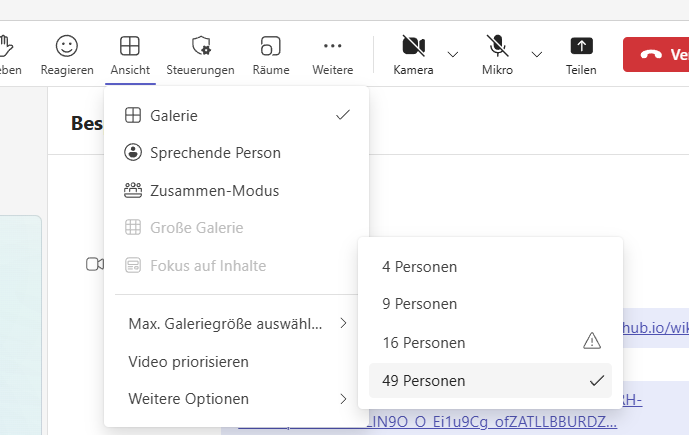
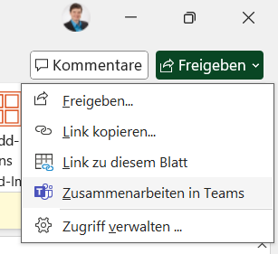
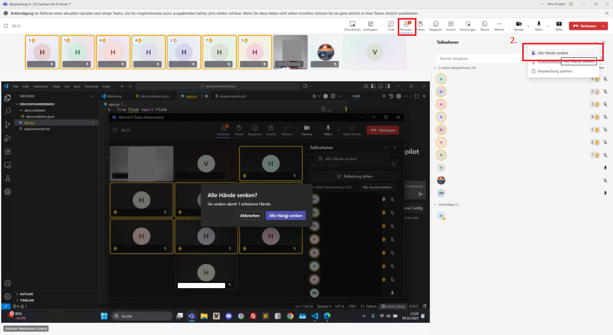
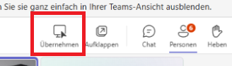
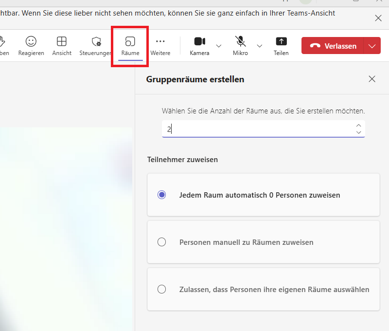
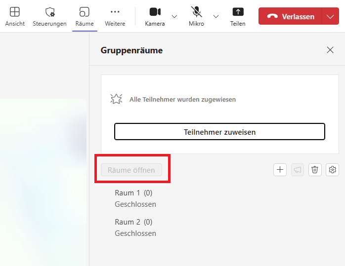
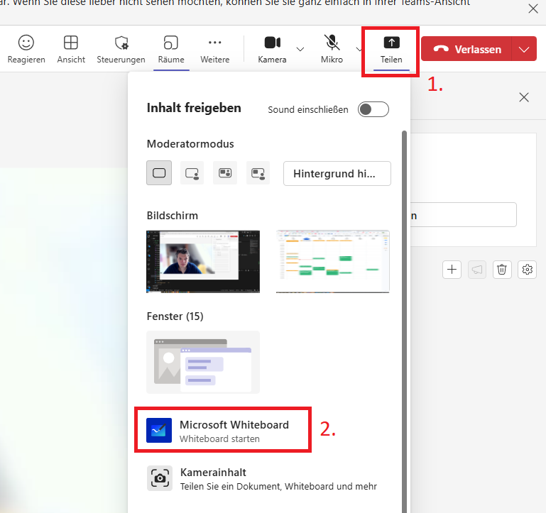
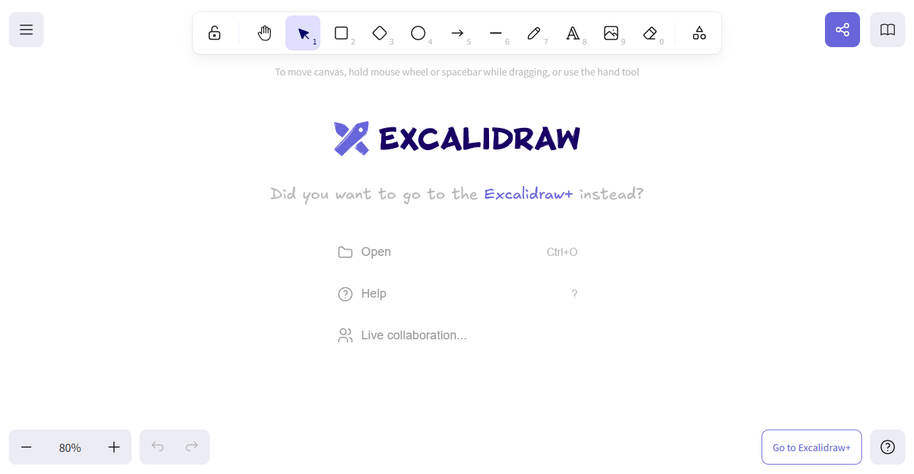

# Technische Hinweise

!!! tip "Alle im Blick"
    { align=right }
    Um alle Teilnehmerkacheln gleichzeitig zu sehen, kann man die Anzahl der angezeigten Kacheln Unter `Ansicht` > `Max. Galariegröße auswählen` > `49 Personen` erhöhen. 

    Weiterhin kann man mit ++ctrl+minus++ im Teams-Anruf herauszoomen. Das sorgt dafür, dass man die Namen der Teilnehmer wieder erkennt. Oder man drückt ++ctrl++ und dreht mit dem Mausrad.

!!! tip "Chat im Blick👁‍🗨"
    Einige Teilnehmer nutzen größtenteils/ausschließlich den Chat zur Kommunikation mit dem Trainer/der Gruppe. Halte ihn also im Auge.

    Gründe dafür sind häufig eine extreme Schüchternheit oder eine laute Umgebung.

!!! tip "Trainer Kamera an"
    Als Trainer haben wir die Kamera (außer in den Pausen) an. Auch in Selbstlernphasen zeigen wir den Teilnehmern so unsere Verfügbarkeit an. 

    Die Teilnehmer können wir nicht dazu verpflichten Ihre Kamera an zu machen, jedoch können wir sie dazu animieren.

!!! tip "Officeprodukte im Call gemeinsam bearbeiten"
    { align=right }
    Word, Excel, usw. Dokumente können über den Button ":fontawesome-regular-share-square: Freigeben" > ":material-microsoft-teams: Zusammenarbeiten in Teams"

!!! tip "Hände heben und senken"

    **Wozu:** Sichstellen, dass eine Aufgabe von **ALLEN** erfüllt ist, bevor weitergemacht wird.

    **Wie:** Teilnehmer bitten die Hand zu heben, wenn die Aufgabe erfüllt ist. So kann man sehen, bei wem es hackt. Gehobene Hände haben, den vorteil, dass sie sichtbar bleiben.
    Die Hände können vom Trainer über die Buttons `Personen` > `...` > `Alle Hände senken` wieder heruntergenommenw werden

    **Achtung:** Wenn die Hand eines Teilnehmers gehoben ist und er dann spricht, wird die Hand automatisch wieder gesenkt! Der Teilnehmer muss dann ans erneute heben errinnert werden.

    Oft müssen die Teilnehmer dazu erzogen werden diese Kultur konsequent durchzuführen.

    

!!! tip "Bildschirmübernahme"
    { align=right }
    Wenn ein Teilnehmer seinen Bildschirm teilt, so kann über den Button `Übernehmen` ein Anfrage an den Teilnehmer gestellt werden, dass Du den Bildschirm steuern kannst. Diese muss noch von dem Teilnehmer bestätigt werden.

!!! tip "Bildschirm vs. Fenster teilen"
    Bei Teams kann man den Gesamten Bildschirm oder nur ein einzelnes Fenster teilen. Darauf muss der Teilnehmer hingewiesen werden. Vor allem dann, wenn wichtige Unterfenster auftauchen und sie bei einer einzelnen Fensterübergabe nicht sichtbar sind.

!!! tip "Die Maus ist dein Finger"
    Nutze die Maus, um die Augen der Teilnehmer aktiv über deinen Bildschirm zu führen, wenn du diesen überträgst. Dein Bildschirm ist groß und hat unglauchblich viel Information gleichzeitig zu sehen. Wenn du also über verschiedene Stellen an deinem Code sprichst, dann hebe diese immer hervor, indem du mit der Maus darüberfährst oder diese markierst. Das fühlt sich nach einem trivialen Hinweis an, aber oft scheitert genau an diesem Punkt die Verständlichkeit eines sonst sehr guten Vortrages.

!!! tip "peinliche Momente vermeiden"
    Bevor du den Bildschirm teilst, solltest du sicherstellen, dass sich nichts darauf befindet, dass du nicht teilen möchtest😱

!!! tip "keine Aufzeichnungen 📹🚫"
    Es ist weder den Trainern, noch den Teilnehmern gestattet Aufzeichnungen vom Unterricht zumachen.
    
    Sollte ein Teilnehmer dies dennoch tun, ist der Unterricht sofort zu unterbrechen, bis die Aufnahme beendet ist. Sollte ein Teilnehmer wiederholt versuchen den Unterricht aufzunehmen, ist er dem Unterricht zu verweisen und es soll Kontakt zum Team aufzunehmen.

!!! tip "Gruppenräume"
    Als Eröffner des Meetings kannst du Gruppenräume erstellen!
    
    
    
    Um die Räume tatsächlich zu öffnen musst du noch auf den Button `Räume öffnen` klicken.
    
    

!!! tip "Umfragen mit dem Chat"
    Teams bietet leider keine Abstimmungsfunktion. Jedoch kann man die Optionen einer Abstimmung einfach in den Chat als einzelne nachrichten formulieren und die Teilnehmer bitten, bei ihrer favorisierten Option einen Daumen zu geben.

!!! tip "Whiteboard"
    
    Du kannst direkt in Teams ein Whiteboard öffnen und mit den Teilnehmern nutzen,
    indem du unter `Teilen` das `Microsoft Whiteboard` auswählst.

    

    ---

    Ein anderes Whiteboard-Tool ist [:fontawesome-solid-external-link: Excalidraw](https://excalidraw.com/){ target=_blank rel="noopener noreferrer" }. Auch hier kann ein Link über die :octicons-share-android-16:-Taste erstellt werden.     

    

!!! tip "technische Probleme beim Teilnehmer"
    Wenn ein Teilnehmer technische Probleme hat, soll dieser sich bei seinem Support, besser noch beim Team vom bfz melden. Dabei sollen sie immer ihre **SFI**-Nummer mitgeben, die auf ihrem Rechner steht, wenn vorhanden.