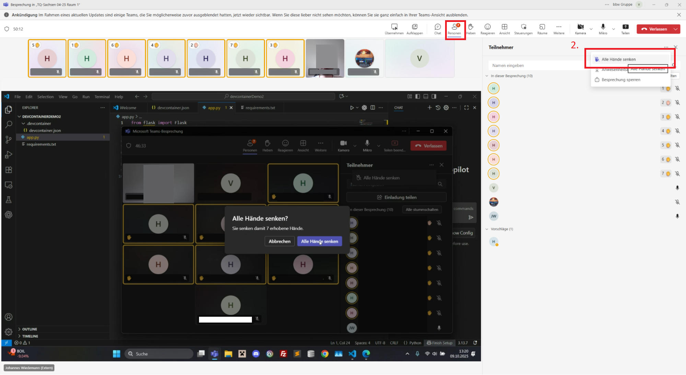
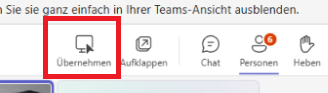
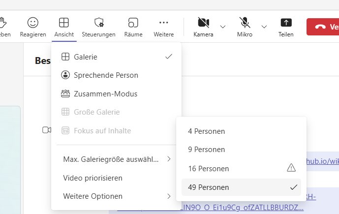
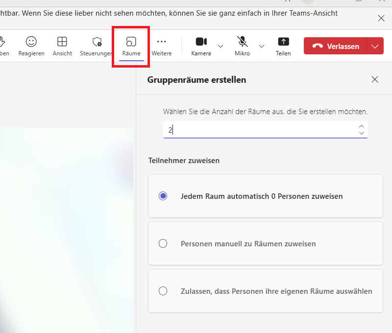
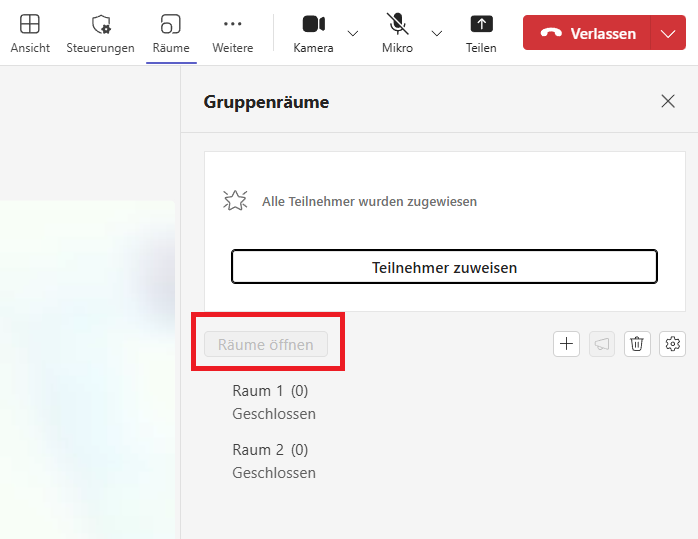
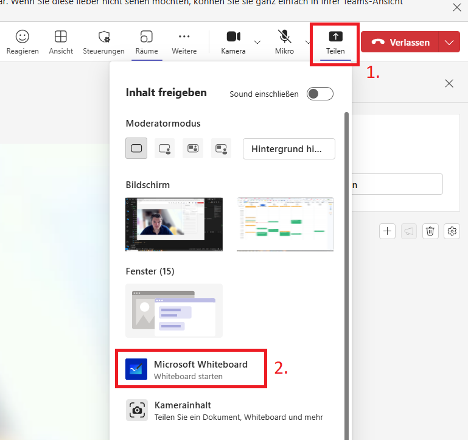
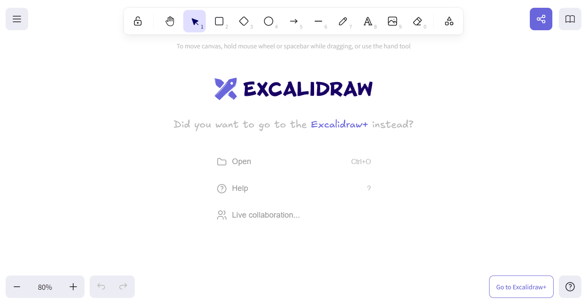

# Praktische Tipps für den Unterricht

!!! tip "Hände heben und senken"

    **Wozu:** Sichstellen, dass eine Aufgabe von **ALLEN** erfüllt ist, bevor weitergemacht wird.

    **Wie:** Teilnehmer bitten die Hand zu heben, wenn die Aufgabe erfüllt ist. So kann man sehen, bei wem es hackt. Gehobene Hände haben, den vorteil, dass sie sichtbar bleiben.
    Die Hände können vom Trainer über die Buttons `Personen` > `...` > `Alle Hände senken` wieder heruntergenommenw werden

    **Achtung:** Wenn die Hand eines Teilnehmers gehoben ist und er dann spricht, wird die Hand automatisch wieder gesenkt! Der Teilnehmer muss dann ans erneute heben errinnert werden.

    

!!! tip "Baby Steps beim Vortanzen"
    Wenn Dinge auf dem Bildschirm vorgemacht werden, die von den Teilnehmern nachgemacht werden, dann sollte das sehr kleinschrittig passieren und häufig nachgefragt werden, ob die Schritte von allen Teilnehmern nachgemacht werden konnten.

    Die Teilnehmer sind schnell abgehängt und haben oft wenig und teilweise gar keine Erfahrung im Umgang mit den Programmen, der IDE. Daher sollten auch so einfache Dinge, wie das Anlegen eines Ordners in VS-Code besser vorgemacht werden.

!!! tip "Bildschirmübernahme"
    { align=right }
    Wenn ein Teilnehmer seinen Bildschirm teilt, so kann über den Button `Übernehmen` ein Anfrage an den Teilnehmer gestellt werden, dass Du den Bildschirm steuern kannst. Diese muss noch von dem Teilnehmer bestätigt werden.

!!! tip "Ist alles Installiert?"
    Hier ist die [:fontawesome-solid-external-link: Liste der Software](https://lms.bbw.de/mod/page/view.php?id=210255){ target=_blank rel="noopener noreferrer" }, die sich auf den Rechner der Teilnehmer befinden sollte.
    Wenn der Unterricht stark auf einer Software basiert, sollte schon einige Wochen vorher geprüft werden, ob diese Installation korrekt funktioniert. Dies kann z.B. geschehen, indem eine Mail an die Teilnehmer gesand wird, dass ein kleines Beispielskript und das Ergebnis einer erfolgreichen Durchführung, samt Mini-Anleitung enthält.
    
    Diese Mail kann über das [Team des bfz](team.md#bfz) an die richtige Klasse gesandt werden.
    
    Hier eine Vorlage:

    ```
    Hallo,
    
    Im kommenden Unterricht in der Kalenderwoche <...>
    werden wir das Tool <...> benötigen.

    Um zu prüfen, dass dieses Tool korrekt bei dir Installiert ist,
    bitte ich dich die folgenden Schritte durchzuführen:

    <Anleitung, ggf. mit Bildern>

    Wenn das Ergebnis so aussieht, dann funktioniert alles einwandfrei.

    <Ergebnis beschreiben>

    Wenn es dir nicht gelingt zu diesem Ergebnis zu kommen, 
    antworte bitte dem Absender dieser Mail 
    und versuche mit ihm alle Probleme bis zum Unterrichtsstart zu lösen.

    Vielen Dank
    ```

!!! tip "Alle im Blick"
    { align=right }
    Um alle Teilnehmerkacheln gleichzeitig zu sehen, kann man die Anzahl der angezeigten Kacheln Unter `Ansicht` > `Max. Galariegröße auswählen` > `49 Personen` erhöhen. 

!!! tip "Gruppenräume"
    Als Eröffner des Meetings kannst du Gruppenräume erstellen!
    
    
    
    Um die Räume tatsächlich zu öffnen musst du noch auf den Button `Räume öffnen` klicken.
    
    

!!! tip "Whiteboard"
    
    Du kannst direkt in Teams ein Whiteboard öffnen und mit den Teilnehmern nutzen,
    indem du unter `Teilen` das `Microsoft Whiteboard` auswählst.

    

    ---

    Ein anderes Whiteboard-Tool ist [:fontawesome-solid-external-link: Excalidraw](https://excalidraw.com/){ target=_blank rel="noopener noreferrer" }. Auch hier kann ein Link über die :octicons-share-android-16:-Taste erstellt werden.     

    

!!! tip "Kalender der Klassen"
    Im {{link("LMS", "https://lms.bbw.de/")}} findet man Unter dem Reiter "IT-BERUFE" und dann "FACHINFORMATIKER/IN AE" oder "FACHINFORMATIKER/IN SI" eine Kachel zu jedem einzelnen Kurs. 

    Dort findet man unter der Kachel "4. Kalender" die Kalender der Klassen. So kann man sehen, wo sich die Teilnehmer gerade inhaltlich befinden.

!!! tip "Prüfungen und Abkürzungen"
    Die Ausbildung der Teilnehmer dauert 2 Jahre in Vollzeit und 3 Jahre in Teilzeit.

    Es gibt zwei Arten von Teilnehmer/innen:

    * Umschüler
    * Teilqualifikation (TQ)

    Die Ausbildung ist in 6 Module aufgeteilt.

    Die Module bestehen aus ca. 8 Wochen Theorieunterricht (mit uns) und 6 Wochen Praxis in einem Praktikumsbetrieb (ohne uns). Danach noch mal eine Woche Prüfungsvorbereitung (mit uns).

    Am Ende der Module findet für die Umschüler eine "Tertialprüfung" (TP) statt. Diese wird manchmal auch als "Modulprüfung" bezeichnet. Für die Teilnehmer der Teilqualifikation findet am Ende jedes Moduls eine "Kompetenzfeststellung" statt.

    Nach den Modulen 3 und 6 findet jeweils eine Abschlussprüfung der IHK statt.

    | Abkürzung | Bedeutung | Wann |
    |-|-|-|
    | TQ | Teilqualifikation |
    | TP | Terialprüfung | am Ende jedes Moduls für Umschüler |
    | KFS | Kompetenzfeststellung | am Ende jedes Moduls für TQ-ler |
    | AP1 | Zwischenprüfung der IHK | am Ende von Modul 3 |
    | AP2 | Abschlussprüfung der IHK | am Ende von Modul 6 |

    {{ link("Detailierte Infomationen für TQ-ler", "https://www.bbw-seminare.de/foerderungen/teilqualifizierungen/fachinformatikerin-fachrichtung-systemintegration-fisi-teilqualifizierung")}}

!!! tip "peinliche Momente vermeiden"
    Bevor du den Bildschirm teilst, solltest du sicherstellen, dass sich nichts darauf befindet, dass du nicht teilen möchtest😱

!!! tip "Bildschirm vs. Fenster teilen"
    Bei Teams kann man den Gesamten Bildschirm oder nur ein einzelnes Fenster teilen. Darauf muss der Teilnehmer hingewiesen werden. Vor allem dann, wenn wichtige Unterfenster auftauchen und sie bei einer einzelnen Fensterübergabe nicht sichtbar sind.

!!! tip "Umfragen mit dem Chat"
    Teams bietet leider keine Abstimmungsfunktion. Jedoch kann man die Optionen einer Abstimmung einfach in den Chat als einzelne nachrichten formulieren und die Teilnehmer bitten, bei ihrer favorisierten Option einen Daumen zu geben.

!!! tip "Dateisharing"
    Dateien können mit den Teilnehmern über das Register "Dateien" in Teams geteilt werden.

!!! tip "Regelmäßiges Fehlen oder Stören"
    Bei Auffälligkeiten bezüglich eines Teilnehmers (z.B. keine Rückmeldung im Unterricht, Störungen, andauernden technischen Problemen) soll eine Mail an das [Team von bfz](team.md) gehen.

!!! tip "Gutes Miteinander"
    Achtet darauf nicht zu viel Zeit mit privaten Themen zu vergeuden.

    Das Angebot einzelnen Teilnehmern Nachhilfe anzubieten, wurde in der Vergangenheit von anderen Teilnehmern als Bevorziehung verstanden. Angebote immer für alle geben.

!!! "Keine Buchempfehlungen"
    Bitte keine Buchempfehleungen "Dieses Buch braucht ihr für den Unterricht" oder "Mit diesem Buch besteht ihr auf jeden Fall" geben.

    Die Teilnehmer verstehen das leicht falsch als eine Verpflichtung dieses Buch kaufen zu müssen.

    Höchsten können sehr vorsichtige Sätze fallen, wie: "Dieses Buch finde ich gut zu dem Thema".