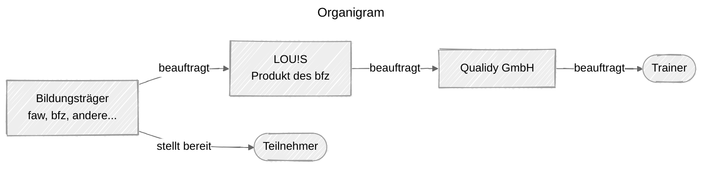
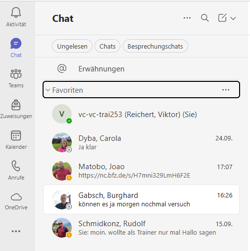

# Team

| Team | Name | Mail im Teams-Chat des bfz | Anmerkungen |
|-|-|-|-|
| bfz | Joao Matobo | {{ mail("joao.matobo@bfz.de") }} | Rufname "Flo" |
| bfz | Carola Dyba | {{ mail("carola.dyba@bfz.de") }} | |
| bfz | Burghard Gabsch | {{ mail("burghard.gabsch@bfz.de") }} | |
| bfz | Rudolf Schmidkonz | {{ mail("Rudolf.schmidkonz@bfz.de") }} | |
| bfz | Technischer Support des bfz | {{ mail("loius@support.bbw.de") }} | Anschreiben, wenn Teilnehmer krank sind |
| Qualidy | Daniel Schmidt | | Per Mail über {{ mail("daniel.schmidt@qualidy.de") }} erreichbar |
| Qualidy | Viktor Reichert | {{ mail("vc-vc-trai253@Schulung-bbw.de") }} | Per Mail nur über {{ mail("viktor.reichert@qualidy.de") }} erreichbar |

!!! tip 
    Füge die wichtigen Kontakte als Favorit hinzu.

    
