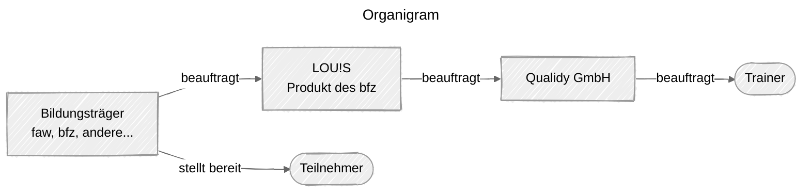
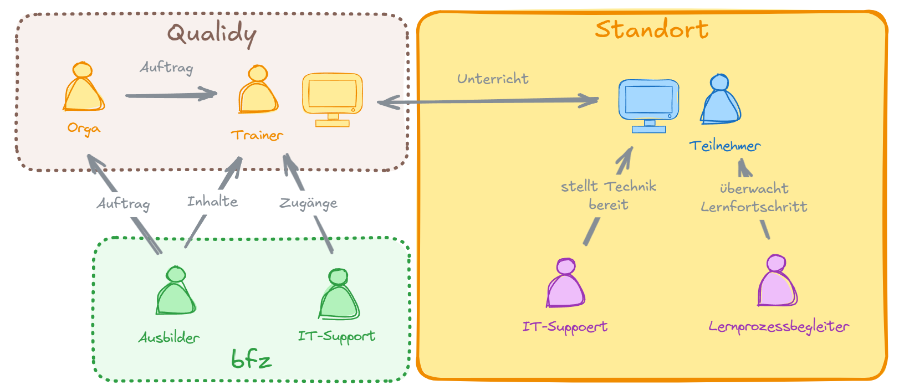

# Anmeldung und Team
{{ youtube_video("https://www.youtube.com/embed/zctcjKm9Ijk?si=yqNCmiIDl8C2ZORy", "Alles zugeschickt?", expanded=True) }}

Lebenslauf senden an: {{ mail("viktor.reichert@qualidy.de") }}

{{ youtube_video("https://www.youtube.com/embed/rGdkZGc5K88?si=ep8M7SI2r9O8FBD9", "Wer ist wer?", expanded=True) }}

``` mermaid
---
title: Organigram
config:
  look: handDrawn
  theme: neutral
---
graph LR

    louis

    louis["LOU!S <p> Produkt des bfz"] --beauftragt--> Qualidy

    Qualidy["Qualidy GmbH"] --beauftragt--> Trainer([Trainer])

    BT["Bildungsträger <p>faw, bfz, andere..."] --beauftragt--> louis
    
    BT --stellt bereit--> Teilnehmer([Teilnehmer])

```

### Kontaktdaten

| Team | Name | Mail im Teams-Chat des bfz | Anmerkungen |
|-|-|-|-|
| bfz | Joao Matobo | {{ mail("joao.matobo@bfz.de") }} | Rufname "Flo" |
| bfz | Carola Dyba | {{ mail("carola.dyba@bfz.de") }} | |
| bfz | Burghard Gabsch | {{ mail("burghard.gabsch@bfz.de") }} | |
| bfz | Rudolf Schmidkonz | {{ mail("Rudolf.schmidkonz@bfz.de") }} | |
| bfz | Technischer Support des bfz | {{ mail("loius@support.bbw.de") }} |  |
| Qualidy | Daniel Schmidt | | Per Mail über {{ mail("daniel.schmidt@qualidy.de") }} erreichbar |
| Qualidy | Viktor Reichert | {{ mail("vc-vc-trai253@Schulung-bbw.de") }} | Per Mail nur über {{ mail("viktor.reichert@qualidy.de") }} erreichbar |

{{ youtube_video("https://www.youtube.com/embed/8bQoZmuIQG8?si=tYNPtUunIn_L7moo", "Einloggen ins LMS", expanded=True) }}

{{ link("Lernmanagmentsystem (LMS) des bfz", "https://lms.bbw.de/") }}

{{ youtube_video("https://www.youtube.com/embed/C7NyuanklKA?si=bP7ZdJch90PuYTA5", "Einloggen bei Teams", expanded=True) }}

{{ link("Login Teams", "https://teams.microsoft.com/v2/") }}

{{ link("Microsoft Teams herunterladen", "https://www.microsoft.com/de-de/microsoft-teams/download-app")}}

{{ youtube_video("https://www.youtube.com/embed/tsjxVUIXT_s?si=qagxhkNx219Cdasp", "Einstellungen für Teams", expanded=True) }}

Checkliste:

* weitere Apps auffindbar
* Teams Kacheln auf Liste umstellen
* Alle Kanäle werden angezeigt
* Profilbild einfügen
* Ausbilder und Qualidymitarbeiter (Viktor Reichert, vc-vc-trai253) als Favouriten speichern.

{{ youtube_video("https://www.youtube.com/embed/sP3qKZygqOM?si=CPX2IbqgOew2Isj3", "Einstellungen für Teams", expanded=True) }}

Abschließend musst du dich nun noch auf dem 
{{ link("Portal für Unterrichtsnachweise", "https://unterrichtsnachweis-service.bfz.de/trainerportal/") }}
anmelden.

Falls das Initiale Passwort `1Changeme!` nicht funktioniert, kannst du unter der Anmeldemaske ein "Neues Kennwort anfordern" klicken.

Die Mail, die du hier angibst, kann entweder die sein, die du Qualidy gegeben hast und wir an das bfz weitergeleitet haben
oder die "vc-vc-trai"-Email, die du von bfz erhalten hast. Im zweiten Fall kannst du auf diese über den Browser zugreifen 
({{ link("outlook.com", "https://outlook.com") }}).

Wichtig: Drückt bei jeder Änderung im Protokoll direkt auf "Speichern". Die Änderungen werden nämlich nicht automatisch gespeichert und es
gab schon einige Trainer, die erstaunt geguckt haben, dass ihr Browser sich nach einigen Stunden "plötzlich" aktualisierte und
alle Ihre Eintragungen verschwunden waren.

Super, jetzt hast du dich zu allen Portalen angemeldet, die du für den Unterricht brauchst!🎉🥂🥳

{{ youtube_video("https://www.youtube.com/embed/f9XNdMaNll0?si=W7HICKkGoCZbeDcK", "Übersicht der Ausbildungszeit", expanded=True) }}

[Alle wichtigen Kontaktdaten](#kontaktdaten)

| Abkürzung | Bedeutung | Wann |
|-|-|-|
| UMS | Umschüler |
| TN | Teilnehmer |
| TQ | Teilqualifikation |
| TP | Terialprüfung | am Ende jedes Moduls für Umschüler |
| KFS | Kompetenzfeststellung | am Ende jedes Moduls für TQ-ler |
| AP1 | Zwischenprüfung der IHK | am Ende von Modul 3 |
| AP2 | Abschlussprüfung der IHK | am Ende von Modul 6 |
| FISI | Fachinformatiker Systemintegration ||
| FIAE | Fachinformatiker Anwendungsentwickler ||
| SFI | Nummer des Teilnehmerrechners | An Support bei Problemen mit dem TN-Rechnern geben |
| LPB | Lernprozessbegleiter | Jeder Teilnehmer hat vor Ort einen LPB, der den Ausbildungsfortschritt überwacht |

Hinweis zu der Modulbenennung: Module mit einer 20 als zweite Zahl, sind immer eine Vorbereitungswoche auf TP oder KFS (z.B. "M3.20 Wiederholung Lernmodul 3, Leistungskontrolle").
Module mit einer 19 als zweite Zahl sind immer eine Vorbereitung auf die AP (z.B. "M6.19a Prüfungsvorbereitung der AP 2 [FIAE]").

{{ youtube_video("https://www.youtube.com/embed/Tot9qS4rWbE?si=tm-oNFobXoeikJ0g", "Beteiligte Personen", expanded=True) }}

