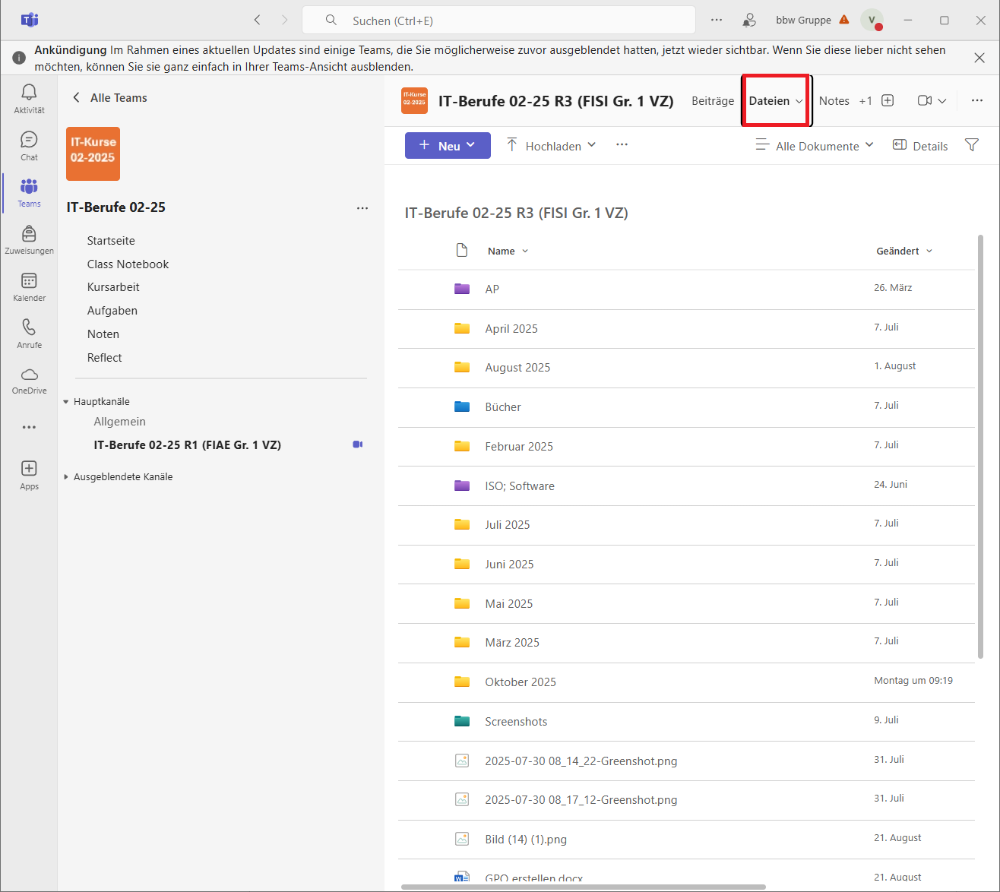

# Unterlagen

## Was muss unterrichtet werden?

Die jeweiligen Inhalte, die im Modul unterrichtet werden sollen, findet man im
{{ link("LMS (Lernmanagmentsystem)", "https://lms.bbw.de/")}}. Klappe zuerst
den Reiter "IT-Berufe" aus und wähle dann das passende Lernmodul. Klicke dann
auf die Kachel "MX-Trainer", wobei "X" die jeweilige Nummer des Moduls ist.

Hist ist eine Übersicht auf aller Themen des Moduls. Klicke auf eine von diesen, um mehr Informationen zu erhalten.

Hier befinden sich die erwarteten Inhalte des Unterricht. Teilwese finden sich hier auch Literaturverweise.

## Simple Club

Auf [:fontawesome-solid-external-link: dieser Webseite](https://lms.bbw.de/course/view.php?id=4633&section=1){ target=_blank rel="noopener noreferrer" } kann man unter dem Link "Simple Club allgemein" Lerninhalte finden.

## Unterlagen anderer Klassen

1) Wähle zunächst eines der Teams aus.

2) Wähle eine Kanal aus (achte dabei auf ausgeblendete Kanäle). Jeder Kanal ist eine eigene Klasse mit eigenen Unterlagen

3) Wähle `Dateien` aus. Jede Klasse ist selbst für die Organisation ihrer Unterlagen verantwortlich.

## Unterlagen im LMS
Teilweise können im LMS auch Inhalte zu den Fächern gefunden werden. Gehe dazu ins Lernmodul und klappe den inneren Reiter aus.

## Unterlagen von Qualidy

Qualidy entwickelt derzeit auch Unterlagen. Dies ist noch in Arbeit.

## IT-Berufe Podcast

{ align=right }
Der {{ link("IT-Berufe Podcast von Stefan Macke", "https://it-berufe-podcast.de/") }} bietet praxisnahe Tipps, Materialien und Erfahrungsberichte zur Ausbildung in IT-Berufen – ideal als ergänzende Ressource für Ausbilder und Trainer.
