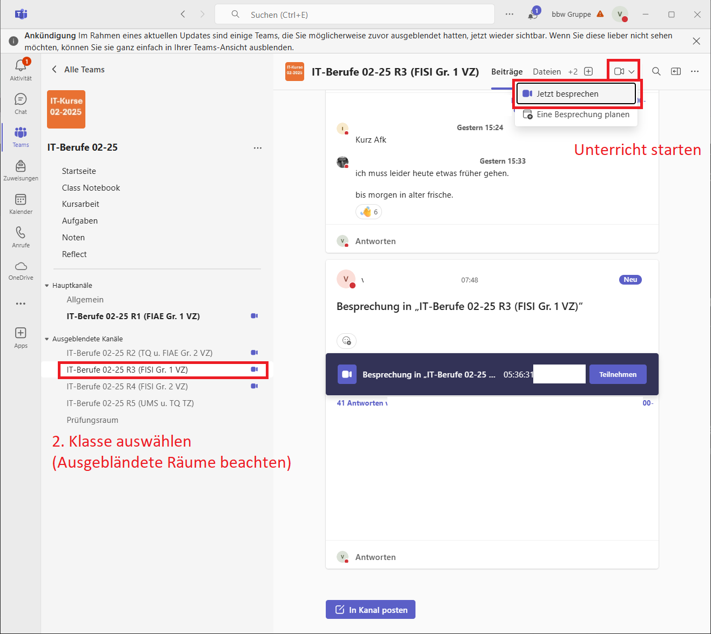

# Unterricht durchführen

## Teams

Über {{ link("diesen Link", "https://www.microsoft.com/de-de/microsoft-teams/download-app#for-desktop") }} erhalten Sie die Möglichkeit, sich die Teams-App für Ihren Desktop herunterzuladen.

Sie müssen bitte die Version für Beruf, Schule und Studium herunterladen, damit Sie sich mit Ihren bfz-Zugangsdaten anmelden können.

Wichtig: Nutzen Sie Ihre bfz-Zugangsdaten, da Sie sonst keinen Zugriff auf Ihre Teams erhalten!

!!! tip "Profilbild einstellen"
    { align=left }

    Bitte Ändere dein Profilbild in Teams.

## Unterricht starten

Am Tag Ihres Unterrichts starten SIE (nicht die Teilnehmenden) eine Besprechung in Ihrem 
Klassenzimmer. Wählen Sie zuerst das passende Team aus.

Danach können Sie die passende Klasse auswählen. Starten Sie den Unterricht in VZ-Klassen 15 Minuten und in TZ-Klassen 30 Minuten vor Unterrichtsstart.

## Unterrichtsnachweis

{{ link("Portal für Unterrichtsnachweise", "https://unterrichtsnachweis-service.bfz.de/trainerportal/") }}

Bei der ersten Nutzung muss ein Passwort beantragt werden. Nutze dazu deine eigene Mail.
Nutze die Mail des bfz nur, wenn du auf Zugriff auf diese eingerichtet hast.

{{ youtube_video ("https://www.youtube.com/embed/iSqt8AvLWQI?si=dcaLX-RCtHBPHEmB") }}

Die Lernfelder jedes Themas kann man im {{ link("Lernmanagmentsystem (LMS) des bfz", "https://lms.bbw.de/") }} nachlesen. Ein Thema kann mehrere Lernfelder haben.

!!! tip "Abwesenheit von Teilnehmern"
    Wenn ein Teilnehmer seine Abwesenheit anmeldet (z.B. "ich muss eine Stunde früher gehen, um zum Arzt zu gehen"), dann kannst du das als Bemerkung in Unterrichtsnachweisservice eintragen.

    Weise den Teilnehmer darauf hin, dass er dies auch mit seinem Lernprozessbegleiter kommuniziert.

!!! tip "Optionen beim Unterrichtsnachweis"
    { align=right }

    Wenn ein Teilnehmer **krank** ist, wähle **Nicht beurteilbar/abwesend** aus.

    Wenn die Teilnehmer den ganzen Tag mit einer Aufgabe beschäftigt sind oder einen Test/Prüfung schreiben und kein aktiver Unterricht stattfindet, wähle **Arbeitsauftrag/Testung - Mitarbeit nicht beurteilbar** aus.

## Hospitation und Qualitätsprüfung

Am Unterricht kann jederzeit ein Mitglied des [Teams](team.md) teilnehmen. Auch eine Befragung der Teilnehmer zum Unterricht (inhaltlich und didaktisch) kann jederzeit stattfinden. Ziel ist eine stetige Verbesserung des Unterrichts.

Viktor hat sehr viel Erfahrung im Umgang mit den Teilnehmern. Bei didaktsichen Fragen kann mit ihm Rücksprache gehalten werden.

!!! tip "Zeugnisse etc."
    Bitte sende deine

    * Zeugnisse,
    * Lebenslauf
    * Zertifikate,
    * Ada-Schein (falls vorhanden)

    an [Viktor und Daniel von der Qualidy GmbH](team.md).
    